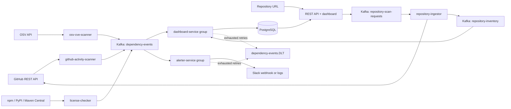

# Dependency Health Monitor

Six independently runnable Spring Boot applications exchange plain JSON messages through Kafka. Scanners never call consumers. The dashboard and alerter use separate consumer groups, so either can stop, restart, scale, or replay without consuming the other's share of events.



## Requirements and quick start

- Docker Engine/Desktop with Compose v2, running Linux containers.
- For running services on your host: JDK 17+ and Maven 3.9+. Java 21 is used in Docker images.
- Internet access to Maven Central and the scanners' public APIs. No API credentials are required for the demo.

Start the infrastructure, then build:

```sh
docker compose up -d --wait
mvn clean verify
```

Kafka uses KRaft (no Zookeeper), listens at `localhost:9092`, and stores data in the named `kafka-data` volume. PostgreSQL listens at `localhost:5432`, with database `dependency_health` and user/password `health`/`health`, using the `postgres-data` volume. Flyway creates the dashboard schema on startup.

Run each command in **its own terminal**, from the project root:

```sh
java -jar dashboard-service/target/dashboard-service-1.0.0-SNAPSHOT.jar
java -jar alerter-service/target/alerter-service-1.0.0-SNAPSHOT.jar
java -jar repository-ingestor/target/repository-ingestor-1.0.0-SNAPSHOT.jar
java -jar github-activity-scanner/target/github-activity-scanner-1.0.0-SNAPSHOT.jar
java -jar osv-cve-scanner/target/osv-cve-scanner-1.0.0-SNAPSHOT.jar
java -jar license-checker/target/license-checker-1.0.0-SNAPSHOT.jar
```

Open **http://localhost:8080**. First polls start after 10 seconds and repeat 60 seconds after the previous poll finishes. Findings normally appear within the first couple of minutes after startup, subject to API availability and rate limits. With no webhook, critical findings appear in the alerter's console. Clean scans also publish informational observations, so healthy packages appear on the dashboard.

The top of the dashboard now provides the quickest path through the product: paste a public GitHub URL such as `https://github.com/Google/guava`, select **Analyze repository**, and leave the page open. The request is queued through Kafka, GitHub prepares an SPDX dependency report asynchronously, and the page updates every two seconds until the dependency list is ready. The worker reads metadata only; it never clones the repository or executes its code.

Alternatively, build and start **all six applications in separate containers** with no local Java installation:

```sh
docker compose --profile apps up -d --build --wait
docker compose logs -f dashboard-service alerter-service
```

The first build downloads Maven dependencies and container images and can take several minutes. Subsequent starts reuse built images. The `apps` profile is optional; the default Compose command starts only Kafka and PostgreSQL. Inside Docker, applications use Kafka's internal `kafka:19092` listener. Each container has its own executable JAR and process.

Stop containers while retaining data:

```sh
docker compose --profile apps down
```

## Modules and independent deployment

| Module | Responsibility | HTTP port |
| --- | --- | --- |
| `event-contract` | JSON schema, validated event model, Kafka transport and public-API HTTP utilities | None; library only |
| `repository-ingestor` | Discovers npm, PyPI, and Maven dependencies from a public GitHub SPDX SBOM | None; event-driven worker |
| `github-activity-scanner` | Repository inactivity and commit-spike observations | None; scheduled worker |
| `osv-cve-scanner` | Version-specific vulnerabilities from OSV | None; scheduled worker |
| `license-checker` | Registry license metadata and configured policy | None; scheduled worker |
| `dashboard-service` | Event persistence, REST API, static dashboard | 8080 |
| `alerter-service` | Severity filtering and Slack webhook/log notifications | 8084; health endpoint |

Every service has its own `pom.xml`, main class and `src/main/resources/application.yml`. No service depends on another service module. To build one application and its library dependency:

```sh
mvn -pl osv-cve-scanner -am package
```

For development with the Spring Boot Maven plugin, first run `mvn install`, then `mvn -pl osv-cve-scanner spring-boot:run` (substitute any service). Only the selected service starts. To build one container independently:

```sh
docker build --build-arg SERVICE=osv-cve-scanner -t dependency-health/osv-cve-scanner .
```

## Configuration

All settings below are optional for local development. Export environment variables in each host service's terminal; Java applications do **not** automatically read `.env`. For Compose, copy `.env.example` to `.env` and edit it. The provided Compose file forwards the token, webhook and alert threshold; add other overrides to the relevant service's `environment` section when needed.

| Service | Environment variable | Default / purpose |
| --- | --- | --- |
| All | `KAFKA_BOOTSTRAP_SERVERS` | `localhost:9092` on host; Compose sets `kafka:19092` |
| GitHub | `GITHUB_TOKEN` | Empty; logs a warning and uses unauthenticated API requests |
| Repository ingestion | `GITHUB_SBOM_POLL_INTERVAL`, `GITHUB_SBOM_MAX_POLLS` | `2s`, `30`; async report polling |
| Repository ingestion | `GITHUB_SBOM_MAX_BYTES`, `GITHUB_SBOM_MAX_DEPENDENCIES` | `25000000`, `20000`; bounded input limits |
| GitHub | `GITHUB_POLL_INTERVAL_MS`, `GITHUB_INITIAL_DELAY_MS` | `60000`, `10000` |
| GitHub | `GITHUB_INACTIVE_MONTHS` | `12` calendar months |
| GitHub | `GITHUB_RECENT_WINDOW_DAYS`, `GITHUB_BASELINE_WINDOW_DAYS` | `7`, `28` preceding days |
| GitHub | `GITHUB_SPIKE_MINIMUM_COMMITS`, `GITHUB_SPIKE_MULTIPLIER` | `10`, `3.0` |
| GitHub | `GITHUB_MAX_COMMIT_PAGES` | `3` pages of 100 commits per repository |
| GitHub | `GITHUB_FAILURE_BACKOFF_MS`, `GITHUB_MAX_FAILURE_BACKOFF_MS` | `60000`, `3600000` |
| OSV | `OSV_POLL_INTERVAL`, `OSV_INITIAL_DELAY` | `60s`, `10s` |
| OSV | `OSV_QUERY_URL`, `OSV_MAX_PAGES` | `https://api.osv.dev/v1/query`, `20` |
| License | `LICENSE_POLL_INTERVAL`, `LICENSE_INITIAL_DELAY` | `60s`, `10s` |
| License | `LICENSE_DISALLOWED` | `GPL-*,LGPL-*,AGPL-*`; comma-separated SPDX names/families |
| License | `LICENSE_MAX_PARENT_DEPTH` | `10`; Maven license inheritance limit |
| Dashboard | `DB_URL` | `jdbc:postgresql://localhost:5432/dependency_health` |
| Dashboard | `DB_USERNAME`, `DB_PASSWORD` | `health`, `health` |
| Dashboard / alerter | `SERVER_PORT` | `8080` / `8084` respectively |
| Dashboard / alerter | `KAFKA_CONSUMER_GROUP` | `dashboard-service` / `alerter-service`; keep distinct |
| Alerter | `ALERT_WEBHOOK_URL` | Empty; log alerts instead of sending them |
| Alerter | `ALERT_SEVERITY_THRESHOLD` | `critical`; accepts `info`, `warning`, `critical` |
| Alerter | `ALERT_CONNECT_TIMEOUT`, `ALERT_READ_TIMEOUT` | `5s`, `10s` |
| Compose Postgres | `POSTGRES_DB`, `POSTGRES_USER`, `POSTGRES_PASSWORD` | `dependency_health`, `health`, `health` |

Changing PostgreSQL initialization variables does not change accounts in an existing database volume. For host services using different credentials, set `DB_USERNAME`/`DB_PASSWORD` too. Compose supplies matching Spring datasource overrides automatically.

API base URL overrides are also available in each producer YAML: `GITHUB_API_BASE_URL`, `NPM_REGISTRY_URL`, `PYPI_REGISTRY_URL`, and `MAVEN_REPOSITORY_URL`. Shared HTTP configuration supports `health.http.connect-timeout` (5s), `health.http.request-timeout` (15s), and `health.http.max-attempts` (3). Set these as Spring properties or environment variables such as `HEALTH_HTTP_REQUEST_TIMEOUT`.

GitHub's unauthenticated allowance is small relative to an eight-repository, one-minute poll. The startup warning explains this; the scanner honors quota-reset/Retry-After headers and pauses requests. For sustained use, set `GITHUB_TOKEN` and increase the polling interval. Commit data may be truncated on active repositories; incomplete history is explicitly reported and cannot produce a false spike.

## Watchlists and interpretation

### Repository dependency discovery

Repository discovery supports public GitHub repositories and extracts npm, PyPI, and Maven packages. It first requests GitHub's SPDX dependency report. If the dependency graph is unavailable or the anonymous API quota is exhausted, it downloads a bounded public source archive and reads `package.json`, `package-lock.json`, `requirements*.txt`, and `pom.xml` files. Neither path executes repository code. A `GITHUB_TOKEN` is optional for public repositories and required for private-repository SBOM access or a larger API quota. The token must be able to read that repository's contents.

Discovery is event driven. `dashboard-service` writes a queued request to PostgreSQL and publishes it to `repository-scan-requests`; `repository-ingestor` retrieves the asynchronous GitHub report and publishes a result to `repository-inventory`; `dashboard-service` consumes and stores that result. The existing scheduled watchlists continue to produce the health findings below the repository inventory. Automatically sending every discovered package to the vulnerability, license, and activity scanners is a separate next step, so the initial repository result is an inventory rather than a combined risk report.

An SPDX result marks dependencies as direct or transitive when GitHub supplies that relationship and includes its declared-license metadata. Source-manifest fallback results are marked partial because requirements can be unpinned and most manifests do not contain a fully resolved transitive graph; unpinned versions display as `unspecified`. A scan fails only when neither GitHub's dependency graph nor supported source manifests can provide an inventory. The dashboard retains recent attempts so users can reopen their results.

Each producer independently declares **all eight packages** in its own `watchlist.packages` list:

- npm: `lodash`, `express`, `chalk`.
- PyPI: `requests`, `flask`, `numpy`.
- Maven: `org.springframework.boot:spring-boot-starter-web`, `com.fasterxml.jackson.core:jackson-databind`.

Edit the service's YAML and rebuild, or use an external configuration file with `--spring.config.additional-location=file:./my-overrides.yml`. Spring replaces a configured list in full; include all entries you want to keep. Example OSV override:

```yaml
watchlist:
  packages:
    - name: lodash
      ecosystem: npm
      version: "4.17.20"
    - name: requests
      ecosystem: pypi
      version: "2.25.1"
```

The GitHub list adds a `repository: owner/repo` field. It examines the default branch's commits. Inactivity uses the latest commit date; spikes compare the recent daily commit rate to a preceding, nonoverlapping baseline and require a minimum recent commit count. These are activity signals, not evidence that a package is unsafe.

The OSV list requires a **version**. Demo versions are intentionally old and should be replaced with versions actually deployed in your applications. Requests use OSV's `npm`, `PyPI`, and `Maven` ecosystem names; event ecosystem names remain lowercase. Pagination is followed, duplicate vulnerability IDs are removed, and withdrawn advisories are excluded. The scanner reports package-specific advisories; it does not resolve transitive dependencies from a lockfile or a Maven dependency tree.

OSV CVSS v2/v3 base vectors and numeric scores map as follows: scores **7–10 → critical**, **4–6.9 → warning**, **below 4 → info**. Vendor `HIGH`/`CRITICAL` ratings also map to critical. The highest usable rating wins. Missing/unsupported severity, including a CVSS v4 vector without a usable vendor rating, maps to warning with the reason in `detail.severityMapping`. Every open advisory is published separately. Findings are published in increasing severity order so the latest OSV observation represents the most severe finding in that completed scan; history retains the others.

License scans use latest npm/PyPI metadata unless a `version` is supplied. Maven versions are pinned in YAML; license metadata is inherited through published parent POMs, with external XML entities disabled. The default license watchlist versions differ from OSV's deliberately vulnerable demo versions; align them for a deployment-specific view. Missing/unknown licenses produce warning findings. A configured disallowed license produces critical findings. The policy conservatively flags disallowed terms even in an `OR` alternative or `WITH` exception for human review; it is not a complete SPDX expression evaluator.

The dashboard shows the latest **observed finding per source**, identified by `(ecosystem, packageName)`. It is not a computed inventory of all unresolved advisories. A clean later scan emits info; an API failure emits no clean event, leaving the last known observation visible. Use observation timestamps to assess freshness and the package history to inspect all findings.

## REST API

```sh
curl -X POST "http://localhost:8080/repositories" -H "Content-Type: application/json" -d '{"repositoryUrl":"https://github.com/Google/guava"}'
curl "http://localhost:8080/repositories?limit=20&offset=0"
curl "http://localhost:8080/repositories/{requestId}"
curl "http://localhost:8080/repositories/{requestId}/dependencies?ecosystem=maven&limit=100&offset=0"
curl "http://localhost:8080/packages?limit=50&offset=0"
curl "http://localhost:8080/packages/lodash/events?ecosystem=npm&limit=20"
curl "http://localhost:8080/packages/com.fasterxml.jackson.core:jackson-databind/events?ecosystem=maven"
curl "http://localhost:8080/events/recent?limit=20"
curl "http://localhost:8080/packages/events?name=%40scope%2Fpackage&ecosystem=npm"
```

Use `curl.exe` in Windows PowerShell if `curl` is aliased. The query-parameter route handles scoped npm names without requiring encoded slashes in path segments. All three collection routes return `{ "items": [...], "limit": 50, "offset": 0, "total": 123 }`. `limit` is 1–200; `offset` is 0–1,000,000. Invalid bounds return HTTP 400. An optional `ecosystem` filter is available on every route. Event history sorts by observation time descending; package responses contain `packageName`, `ecosystem`, `lastUpdated`, and `latestFindings`.

The dashboard and alerter expose `/actuator/health`. The dashboard page polls the API, shows latest observations and package history, and renders external strings as text.

## Kafka contract and delivery behavior

The versioned machine-readable contracts live in [`event-contract/src/main/resources/schema`](event-contract/src/main/resources/schema); the Java records and JSON codecs implement them. Topic names are defined in `EventTopics`. Any independent process that can publish the documented JSON can participate; no Java-specific serialization headers are required.

```json
{
  "eventId": "00000000-0000-4000-8000-000000000001",
  "source": "osv-cve",
  "packageName": "lodash",
  "ecosystem": "npm",
  "severity": "critical",
  "summary": "Example vulnerability finding",
  "detail": { "version": "4.17.20", "vulnerabilityId": "example-only" },
  "timestamp": "2026-09-12T12:00:00Z"
}
```

- Kafka key: `ecosystem:packageName`, preserving per-partition order for each package. Producers generate a fresh UUID for each observation; polling the same issue again is a new observation.
- `dependency-events`, `repository-scan-requests`, `repository-inventory`, and each topic's `.DLT` are created by each application's KafkaAdmin as needed (three partitions, replication factor one for local dev). Configure `health.kafka.partitions` and `health.kafka.replicas` for a different cluster. Kafka automatic topic creation is disabled.
- Producers enable idempotent Kafka sends with `acks=all`, bounded delivery timeouts, and confirmation of send completion. API/network failures are isolated to a package; retries use backoff and later scheduled polls. There is no durable producer outbox: a process crash before Kafka acknowledges can lose that particular observation; a later poll observes the package again.
- Consumers disable auto-commit and acknowledge a record after processing. Transient failures receive three retries with exponential delay, then the original payload and failure/group headers go to the DLT. Invalid JSON/schema records go directly to the DLT. If DLT publication also fails, the source offset is not acknowledged as recovered.
- Dashboard inserts use the UUID primary key with `ON CONFLICT DO NOTHING`. Kafka redelivery is safe, and older late arrivals do not replace newer observations. Each successfully processed event is stored once; failed records in the DLT require repair and replay to enter Postgres.
- Slack delivery is **at least once**. A crash after a successful webhook but before offset commit can duplicate a notification. Repeated scheduled observations can also repeat alerts. The event ID appears in notification text; no persistent alert deduplication or incident-resolution workflow is included.
- Each consumer group independently encounters and may dead-letter the same bad record. DLT headers identify the original consumer group. The DLT is an operations queue; it is not consumed or automatically replayed by these services.
- Consumers using a new group start at the earliest retained event. Existing groups resume their committed offsets. Local broker retention is seven days; PostgreSQL history has no automatic deletion policy.

## Verify independence and inspect failures

With applications running, inspect groups and read raw messages using a **third** consumer group:

```sh
docker compose exec kafka /opt/kafka/bin/kafka-consumer-groups.sh --bootstrap-server kafka:19092 --all-groups --describe
docker compose exec kafka /opt/kafka/bin/kafka-console-consumer.sh --bootstrap-server kafka:19092 --topic dependency-events --group manual-inspection --from-beginning --max-messages 5
docker compose exec kafka /opt/kafka/bin/kafka-console-consumer.sh --bootstrap-server kafka:19092 --topic dependency-events.DLT --from-beginning --property print.headers=true
```

Stop just the alerter process/container. Dashboard event counts continue increasing. Restart the alerter: it resumes from its own offset and catches up. Repeat with the dashboard stopped: alerts continue, and the dashboard catches up on restart within Kafka's retention window. Producers can run with both consumers stopped.

For a deterministic manual transport check without relying on external APIs, send the example JSON above through `kafka-console-producer.sh` (one line per message):

```sh
docker compose exec kafka /opt/kafka/bin/kafka-console-producer.sh --bootstrap-server kafka:19092 --topic dependency-events
```

Use a fresh event UUID and current timestamp for each new observation. Sending the same UUID twice should create only one dashboard row. Sending a malformed line should create a DLT record per consumer group; a valid line afterward should still be processed. Do not replay a whole DLT blindly: inspect the group and reason, correct the cause, and republish the intended records. Republished records are visible to both consumer groups; dashboard duplicate IDs remain safe, but alerts can repeat.

## Tests and operational scope

`mvn verify` runs producer classification/registry/scheduler tests, JSON contract validation, repository URL and SPDX parsing tests, REST and consumer tests, and a real embedded Kafka test proving independent groups and poison-message recovery. The GitHub client test also verifies that credentials are not forwarded to GitHub's temporary report-download host. Tests need a JDK and dependencies but no Docker, PostgreSQL, external APIs, or real webhook. Kafka's test broker is temporary and isolated from Compose.

The optional PostgreSQL integration suite uses a real disposable database container:

```sh
mvn -pl dashboard-service -am -Ppostgres-it verify
```

It exercises Flyway, JSONB persistence, UUID deduplication, timestamp ordering, package/source separation, and pagination. Docker must be available for that profile.

The local stack has one broker, local development credentials, and plaintext Kafka. Applications are independently deployable, but production operation also needs deployment-specific Kafka authentication/TLS and replication, API authentication for the dashboard, secret management, monitoring of consumer lag/DLTs, backup and retention policies, and an alert deduplication strategy appropriate to the destination.

Implementation references: [Spring Boot 3.5.11 release](https://spring.io/blog/2026/02/19/spring-boot-3-5-11-available-now), [Kafka Docker documentation](https://kafka.apache.org/39/getting-started/docker/), [Spring Kafka error handling](https://docs.spring.io/spring-kafka/reference/kafka/annotation-error-handling.html), [GitHub dependency SBOM API](https://docs.github.com/en/rest/dependency-graph/sboms), [GitHub commits API](https://docs.github.com/en/rest/commits/commits), [OSV query API](https://google.github.io/osv.dev/post-v1-query/), [OSV schema](https://ossf.github.io/osv-schema/), [PyPI JSON API](https://docs.pypi.org/api/json/), and [Maven POM licenses](https://maven.apache.org/pom.html#Licenses).
